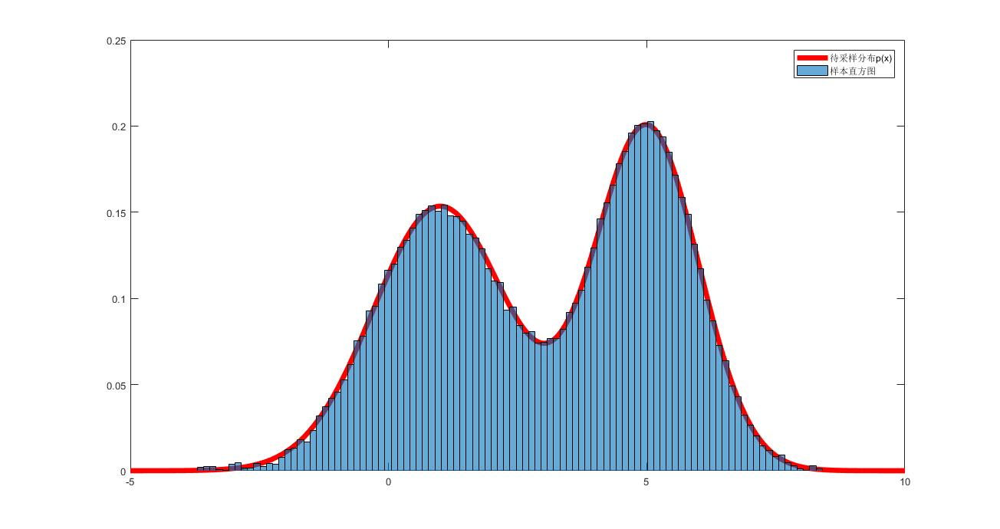
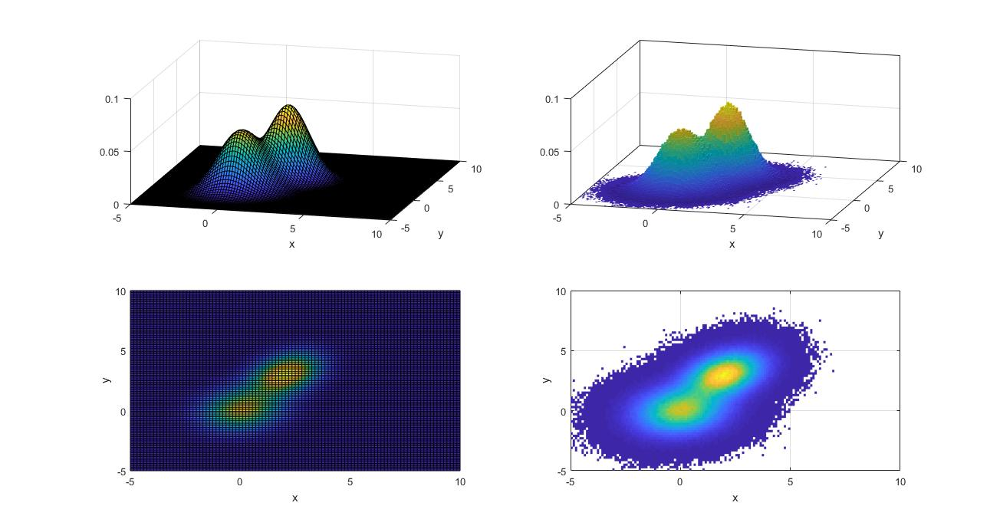

# Gibbs 采样基本原理和仿真

[TOC]

## 1. 基本概念

### 1.1 Gibbs采样算法

 		**==采样==**是指从任意给定的一个概率分布中生成服从这个分布的随机样本。Gibbs采样通过利用Markov链的平稳性质从一个给定的概率分布中采样。

### 1.2 Markov链

#### 1.2.1 Markov链的定义

​		一阶Markov链定义为一列的随机变量$z^{(1)},...,z^{(M)}$，使得下面的独立性质对于$m\in\{1,...,M-1\}$成立
$$
p(z^{(m+1)}|z^{(1)},...,z^{(m)})=p(z^{(m+1)}|z^{(m)})
$$

#### 1.2.2 Markov链的细致平稳条件

​		记某个齐次Markov链的转移矩阵中的元素$T(z^{(m)},z^{(m+1)})\equiv p(z^{(m+1)}|z^{(m)})$。如果存在$p^{*}(z)$使得
$$
p^{*}(z)T(z,z^{’})=p^{*}(z^{'})T(z^{'},z)
$$
成立，则称该Markov链的满足**==细致平稳条件==**，此Markov链会收敛到**==稳态分布$p^{*}(z)$==**。且这个稳态分布与初值无关。这样当这个Markov链达到稳态后，该Markov链中的所有状态发生的概率将会服从稳态分布$p^{*}(z)$。

#### 1.2.3 Markov chain Monte Carlo方法

​		设$p^{*}(z)$为给定的待采样概率分布（$z$为随机变量），如果我们构造出一个Markov链（其转移矩阵中的元素用$T(z,z^{'})$表示，其中$z$和$z^{'}$表示Markov链的状态），使得这个Markov链满足1.2.2中的细致平稳条件，则当Markov链的状态发生的概率收敛到平稳分布后，Markov链中每次到达的状态都可以看做是从概率分布$p^{*}(z)$中进行一次随机采样。

​		所以重要的是如何构造出一个Markov链，它的状态值和待采样分布的随机变量取值相同，并且采用拒绝采样的方法对此Markov链进行修正，使得修正后的Markov链满足细致平稳条件，这样当修正后的Markov链达到平稳分布后，从此修正的Markov链中生成的状态即可以看做是从待采样分布中进行的一次随机采样，这个采样值服从待采样分布。

## 2. Metropolis算法

### 2.1 算法原理

​		设$p(z)$为待采样分布，$q(z^{*}|z)$为提议分布，且$q(z^{*}|z)=q(z|z^{*})$，下面对提议分布中的样本设置接收率为
$$
A(z^{*},z)=min\left(1,\frac{p(z^{*})}{p(z)}\right)
$$
下面证明在上述提议分布和接受率下，此Markov链满足细致平稳条件：
$$
\begin{align}
p(z)q(z^{*}|z)A(z^{*},z)
&=p(z)q(z^{*}|z)min\left(1,\frac{p(z^{*})}{p(z)}\right)\\
&=min\left(p(z)q(z^{*}|z),p(z^{*})q(z^{*}|z)\right)\\
&=min\left(p(z^{*})q(z|z^{*}),p(z)q(z|z^{*})\right)\\
&=p(z^{*})q(z|z^{*})min\left(1,\frac{p(z)}{p(z^{*})}\right)\\
&=p(z^{*})q(z|z^{*})A(z,z^{*})
\end{align}
$$
于是待采样分布$p(z)$即是上述Markov链的平稳分布，而稳定后Markov链中转移的状态就可以看做是从待采样分布中的随机样本。

## 3. Metropolis-Hastings算法

### 3.1 算法原理

​		设$p(z)$为待采样分布，$q(z^{*}|z)$为提议分布，提议分布中的样本接收率设置为
$$
A(z^{*},z)=min\left(1,\frac{p(z^{*})q(z|z^{*})}{p(z)q(z^{*}|z)}\right)
$$
下面证明上述提议分布和接受率下，此Markov链满足细致平稳条件：
$$
\begin{align}
p(z)q(z^{*}|z)A(z^{*},z)
&=p(z)q(z^{*}|z)min\left(1,\frac{p(z^{*})q(z|z^{*})}{p(z)q(z^{*}|z)}\right)\\
&=min\left(p(z)q(z^{*}|z),p(z^{*})q(z|z^{*})\right)\\
&=min\left(p(z^{*})q(z|z^{*}),p(z)q(z^{*}|z)\right)\\
&=p(z^{*})q(z|z^{*})min\left(1,\frac{p(z)q(z^{*}|z)}{p(z^{*})q(z|z^{*})}\right)\\
&=p(z^{*})q(z|z^{*})A(z,z^{*})
\end{align}
$$
于是待采样分布$p(z)$即是上述Markov链的平稳分布，而稳定后Markov链中转移的状态就可以看做是从待采样分布中的随机样本。

​		可以看到当建议分布$q(z^{*}|z)$满足条件对称性是，即退化为Metropolis算法。

### 3.2 算法仿真

#### 3.2.1 参数设置

​		设待采样分布为：$p(x)=0.5*N(x;1,1.3^{2})+0.5*N(x;5,1^{2}))$。

​		选择提议分布：$q(x^{'}|x)=N(x^{'};x,1^{2})$。

​		提议分布中的样本接受率为：$A(z^{'},z)=min\left(1,\frac{p(z^{'})q(z|z^{'})}{p(z)q(z^{'}|z)}\right)$，由于提议分布为正态分布，所以$q(z^{'}|z)=q(z|z^{'})$，$A(z^{'},z)=min\left(1,\frac{p(z^{'})}{p(z)}\right)$。

#### 3.2.2 算法流程

* 1. 选择初始状态$x_{0}$。

* 2. 从$q(x^{'}|x_{0})$中采样，得到$y$。

* 3. 计算接受率$A(y,x_{0})$。从均匀分布$U(0,1)$中采样得到$u$，如果$u<A(y,x_{0})$，则接受$y$，并令$y\rightarrow x_{0}$；否则丢弃$y$。

* 4. 回到第2步。当该Markov链达到平稳分布后，$x_{0}$即为从分布$p(x)$中采样的随机样本。

#### 3.2.3 仿真结果

​		经过$10^{8}$次Markov链状态转移后，再采样$10^{8}$次的MATLAB仿真图如下

​		其中红色的实线为待采样的分布$p(x)$，蓝色的直方图为MH算法中Markov链达到稳态分布后对采样值进行的概率统计，可以看到采样值的分布和待采样分布非常接近。

## 4. Gibbs采样

### 4.1 Gibbs采样原理

​		在细致平稳条件中，转移概率可以被分解为一组**基转移**$B_{1},\cdots,B_{K-1},B_{K}$的组合，即
$$
T(z^{'},z)=\sum_{z_{K-1}}\cdots\sum_{z_{1}}B_{1}(z^{'},z_{1})\cdots B_{K-1}(z_{K-2},z_{K-1})B_{K}(z_{K-1},z)
$$
如果一个概率分布关于每个基转移都是不变的，则这个概率分布关于组合后的基转移也是不变的。

​		在Gibbs采样中我们选择基转移为如下形式，即第$k$维的基转移为
$$
B_{k}(z^{'},z)=q_{k}(z|z^{'})=p(z_{k}|z_{\backslash k}^{'})
$$
其中$z_{\backslash k}^{'}$表示除去第$k$维分量后剩余的分量集合。

​		假设待采样分布为$p(z)$，$z=(z_{1},\cdots,z_{M-1},z_{M})$为$M$维随机变量，选择Gibbs采样中的基转移，则对第$k$维基转移$B_{k}(z^{'},z)$，下面证明$p(z)$为$B_{k}$的不变分布，只需证明$B_{k}$满足细致平稳条件
$$
\begin{align}
p(z^{'})B_{k}(z^{'},z)
&=p(z^{'})p(z_k|z_{\backslash k}^{'})=p(z^{'})q_{k}(z|z^{'})\\
&=p(z^{'}_{k},z^{'}_{\backslash k})\frac{p(z_{k},z_{\backslash k}^{'})}{p(z_{\backslash k}^{'})}\\
&=\frac{p(z^{'}_{k},z^{'}_{\backslash k})}{p(z_{\backslash k}^{'})}p(z_{k},z_{\backslash k}^{'})\\
&=\frac{p(z^{'}_{k},z_{\backslash k})}{p(z_{\backslash k})}p(z_{k},z_{\backslash k})\\
&=p(z)p(z^{'}_{k}|z_{\backslash k})=p(z)q_{k}(z^{'}|z)\\
&=p(z)B_{k}(z,z^{'})
\end{align}
$$
其中$k\in \{1,\cdots,M-1,M\}$。所以分布$p(z)$关于这些基转移的组合$T(z^{'},z)$也是不变的。这样当此Markov链达到稳态是，Markov链中转移的状态就会服从分布$p(z)$。可以看出Gibbs采样可看成是Metroplis-Hastings算法的特例，即从来自提议分布样本以概率1接受，接受率$A(z^{'},z)=1$。

### 4.2 算法流程

* 1. 初始化$z_{i}^{0},i\in \{1,\cdots,M\}$

* 2. 对于$\tau=1,\cdots,T$

     * 采样$z^{\tau+1}_{1}\sim p(z_{1}|z_2^{\tau},z_3^{\tau},\cdots,z_M^{\tau})$

     * 采样$z^{\tau+1}_{2}\sim p(z_{2}|z_1^{\tau+1},z_3^{\tau},\cdots,z_M^{\tau})$

     - $\vdots$

     * 采样$z^{\tau+1}_{j}\sim p(z_{j}|z_1^{\tau+1},\cdots,z_{j-1}^{\tau+1},z_{j+1}^{\tau}\cdots,z_M^{\tau})$

     - $\vdots$

     * 采样$z^{\tau+1}_{M}\sim p(z_{M}|z_1^{\tau+1},z_2^{\tau+1},\cdots,z_{M-1}^{\tau+1})$

     * 得到$z_{i}^{\tau+1},i\in \{1,\cdots,M\}$

### 4.3 算法仿真

#### 4.3.1 参数设置

​		设待采样分布为2维高斯混合分布
$$
p(x,y)=0.5*N_{1}\left(\begin{bmatrix} x\\y \end{bmatrix};\begin{bmatrix} 0\\0 \end{bmatrix},\begin{bmatrix} 1.5&0.2\\0.2&1.4 \end{bmatrix}\right)+0.5*N_{2}\left(\begin{bmatrix} x\\y \end{bmatrix};\begin{bmatrix} 2\\3 \end{bmatrix},\begin{bmatrix} 1.1&0.4\\0.4&1.3 \end{bmatrix}\right)
$$
基转移为
$$
B_{1}=p(x|y)=\frac{p_{Y_{1}}(y)}{p_{Y_{1}}(y)+p_{Y_{2}}(y)}*N(x;\mu_{1},\sigma_{1}^{2})+\frac{p_{Y_{2}}(y)}{p_{Y_{1}}(y)+p_{Y_{2}}(y)}*N(x;\mu_{1}^{'},{\sigma_{1}^{'}}^{2})\\
B_{2}=p(y|x)=\frac{p_{X_{1}}(x)}{p_{X_{1}}(x)+p_{X_{2}}(x)}*N(y;\mu_{2},\sigma_{2}^{2})+\frac{p_{X_{2}}(x)}{p_{X_{1}}(x)+p_{X_{2}}(x)}*N(y;\mu_{2}^{'},{\sigma_{2}^{'}}^{2})
$$
算法流程如4.2节所述。

#### 4.3.2 仿真结果

​		左侧是待采样分布$p(x,y)$的三维图和俯视图，右侧为Gibbs采样算法中得到的采样样本的概率分布图，可以看出，采样样本的分布和待采样分布很接近。

## 5. 结论

​		这些采样方法的共同点是利用容易采样的提议分布，对提议分布进行采样，得到样本，并以一定的接受率去接受样本，通过接受率来改变该样本发生的概率，使得该样本发生的概率等于待采样的分布下的概率。从而这些样本也就服从待采样分布。